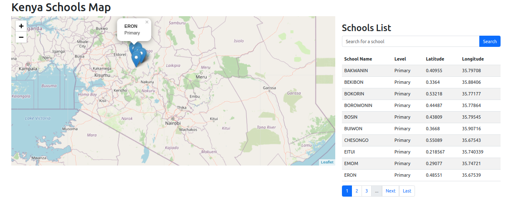

# Kenya Schools GIS



This is a simple Flask web application that allows you to visualize schools in Kenya on a map. The app reads data from a shapefile containing the locations of primary and secondary schools provided by the Kenya Ministry of Education.

## Requirements

- Python 3.x
- Flask
- Geopandas
- Folium

## Getting Started

1. Clone the repository:

```
git clone https://github.com/SoftCysec/Kenya-Schools-GIS.git

cd Kenya-Schools-GIS
```
2. Create a virtual environment (optional, but recommended):
```
python3 -m venv venv

source venv/bin/activate
```
3. Install the required packages:
```
pip install -r requirements.txt
```
4. Run the Flask app:
```
python app.py
```

- Open your web browser and go to `http://127.0.0.1:5000/` to view the Kenya Schools Map.

 ## Features
- Visualize schools in Kenya on a map
- Paginate the schools list
- Search for schools by name
- Zoom in on the map to view searched schools

## Credits
The shapefile data for Kenya schools is provided by the Kenya Ministry of Education and can be found [here](https://datacatalog.worldbank.org/search/dataset/0038039).

## License
This project is licensed under the [MIT License](https://github.com/git/git-scm.com/blob/main/MIT-LICENSE.txt)
